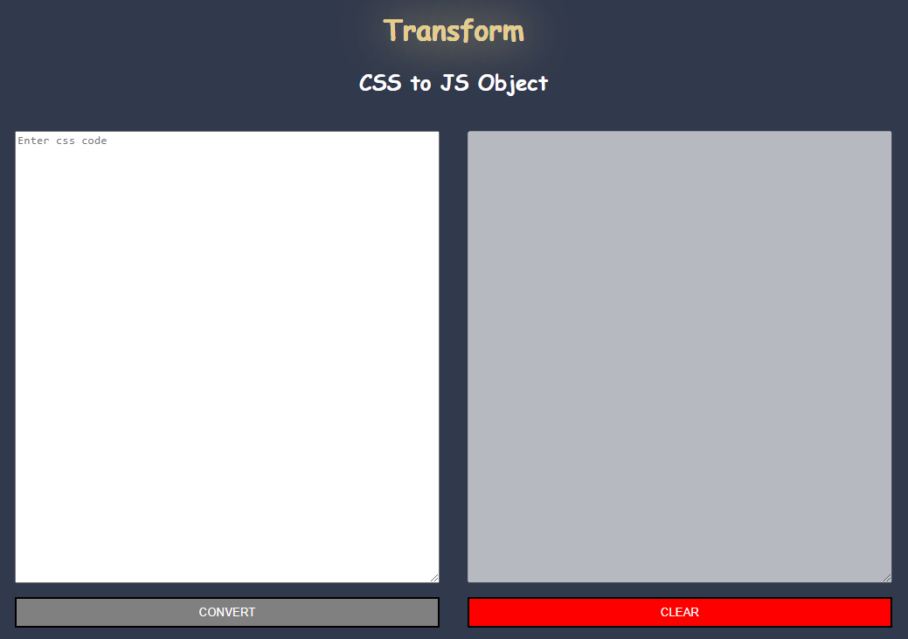
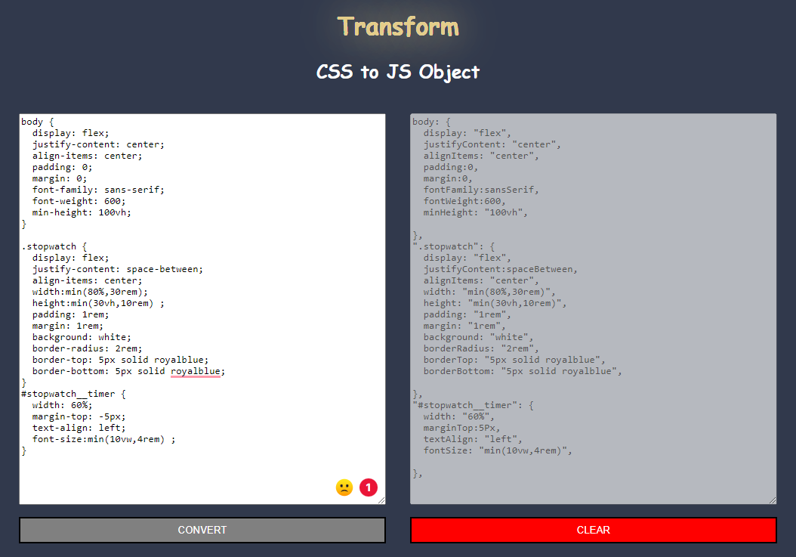
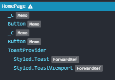
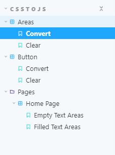

# TRANSFORM TOOL: CSS TO JS OBJECT

## Requirement

[](https://img.shields.io/badge/react-%5E18.2.0-blue)
[](https://img.shields.io/badge/node-%5E14.17.6-blue)
[](https://img.shields.io/badge/vite-%5E3.0.0-blue)
[](https://img.shields.io/badge/typescript-%5E4.7.4-blue)
[](https://img.shields.io/badge/eslint-%5E8.20.0-blue)
[](https://img.shields.io/badge/prettier-%5E2.7.1-blue)
[](https://img.shields.io/badge/platform-window%20%7C%20linux-blue)

## Introduction

Designed a transfer tool from CSS syntax to JS object.

User Interface:
| Before | After |
|------|-------|
|| |

## Setup

Install npm management tool dependencies:

```console
npm install
```

## Available Scripts

In the project directory, you can run:

### `npm start`

Runs the app in the development mode.\
Open [http://127.0.0.1:5173](http://127.0.0.1:5173) to view it in your browser.

The page will reload when you make changes.
You may also see any lint errors in the console.

### `npm run lint`

Running it will look for problems in the project and bring up the console but won't fix it

### `npm run lint:fix`

Running it will look for problems in the project and fix them. If the problem cannot be fixed, it will show up in the console

### `npm run format`

Running it will call prettier to fix the code style.

### `npm run storybook`

It will start Storybook locally and output the address (`default port: 6006`).

Depending on your system configuration, it will automatically open the address in a new browser tab, and you'll be greeted by a screen.

## Data Flow

Component architecture:



Support functions:

- `Tokenizer:` truncate CSS syntax into different tokens based on special characters _['{', '}', ':', ';' ]_
- `convertToJs`: concatenate tokens together into a js object according to a certain rule

Transform rules:

- If it's class or id, add double quotes _( "" )_

```text
    .wrapper-data => ".wrapper-data"
    #keep => "#keep"
```

- If there are two or more tags (tag, class or id), add double quotes _( "" )_

```text
    .wrapper-data, li, #hello => ".wrapper-data, li, #hello"
```

- If it's a tag and not a class or id, leave it as is and don't add quotes _( "" )_

```text
    li => li
    ul => ul
```

- If the attribute's value is numeric, keep it the same

```text
    flex: 1 => flex: 1
```

- If attribute is in kebabCase format, convert to camelCase

```text
    font-family => fontFamily
```

- Convert _( ; )_ to _( , )_

```text
    margin: 0; => margin: 0,
```

- If the attribute's value is not a number or more than two value, add double quotes _( "" )_

```text
    line-height: 44px; => lineHeight: "44px",
    margin: 3px 4px; => margin: "3px 4px",
```

- Before an attribute block must add _( : )_. At the end of the attribute block must add _( , )_

```text
    li {              li: {
        ...    =>         ...
    }                 },
```

Example:

CSS syntax

```text
body {
  display: flex;
  justify-content: center;
  align-items: center;
  padding: 0;
  margin: 0;
  font-family: sans-serif;
  font-weight: 600;
  min-height: 100vh;
}
.stopwatch {
  display: flex;
  justify-content: space-between;
  align-items: center;
  width:min(80%,30rem);
  height:min(30vh,10rem) ;
  padding: 1rem;
  margin: 1rem;
  background: white;
  border-radius: 2rem;
  border-top: 5px solid royalblue;
  border-bottom: 5px solid royalblue;
}
#stopwatch__timer {
  width: 60%;
  margin-top: -5px;
  text-align: left;
  font-size:min(10vw,4rem) ;
}
```

JS Object

```text
body: {
  display: "flex",
  justifyContent: "center",
  alignItems: "center",
  padding:0,
  margin:0,
  fontFamily:sansSerif,
  fontWeight:600,
  minHeight: "100vh",

},
".stopwatch": {
  display: "flex",
  justifyContent:spaceBetween,
  alignItems: "center",
  width: "min(80%,30rem)",
  height: "min(30vh,10rem)",
  padding: "1rem",
  margin: "1rem",
  background: "white",
  borderRadius: "2rem",
  borderTop: "5px solid royalblue",
  borderBottom: "5px solid royalblue",

},
"#stopwatch__timer": {
  width: "60%",
  marginTop:5Px,
  textAlign: "left",
  fontSize: "min(10vw,4rem)",

},
```

## Story Book



## Achievement

- Apply TypeScript more deep and strict
- Understanding the purpose and appliance of Storybook
- Splitting components
- Write a complete storybook's component
- Usage of Radix, Stitches.dev and Storybook
- Use Git conventiional commit
- UI is a plus but we focusing on the usage of `stiches.dev` more

## Appendix

- [TypeScript Handbook](https://www.typescriptlang.org/docs/handbook/intro.html)
- [Storybook](https://storybook.js.org/docs/react/get-started/introduction)
- [Radix Primitive](https://www.radix-ui.com/docs/primitives/overview/introduction)
- [Stitches.dev](https://stitches.dev/docs/installation)
